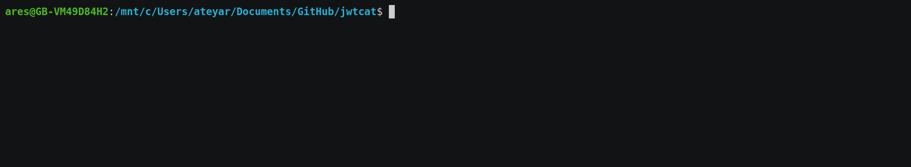
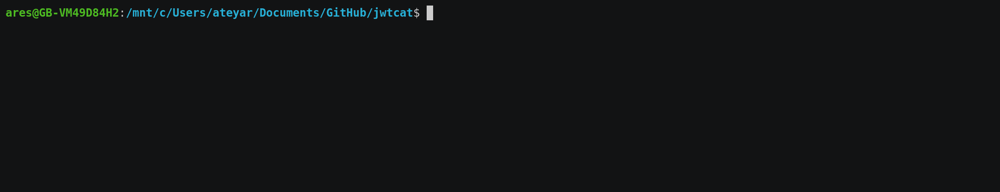
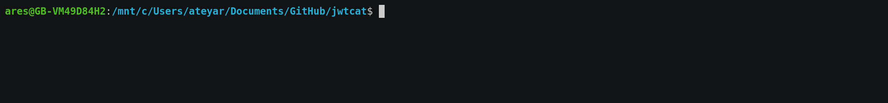

# jwtcat

[](https://www.python.org)
[](https://opensource.org/licenses/Apache-2.0)

## A CPU-based JSON Web Token (`JWT`) cracker and - _to some extent_ - scanner

`jwtcat` is a `Python script` designed to detect and exploit well-known cryptographic flaws present in JSON Web Token (`JWT`).

These vulnerabilities, if successfully exploited by an adversary could allow authentication bypass, information disclosure and could ultimately lead to the compromise of an entire information system.

More information about `JWT` vulnerabilities can be found at:

- <https://auth0.com/blog/critical-vulnerabilities-in-json-web-token-libraries/>

## Features

- Test against the following vulnerabilitie(s):
  - [CVE-2018-1000531](https://nvd.nist.gov/vuln/detail/CVE-2015-2951): `JWT` signature bypass due to the use of `None` hashing algorithm (`alg=none`)
- Guessing attacks against `JWT` private keys **signed with the `HS256` hashing algorithm**:
  - Brute-force attacks
  - Wordlist attacks

## Requirements

`jwtcat` is fully written in `Python 3` and **requires a minimum of `Python 3.6`** in addition to the following libraries:

- [coloredlogs](https://pypi.org/project/coloredlogs/)
- [PyJWT](https://pypi.org/project/PyJWT/)
- [tqdm](https://pypi.org/project/tqdm/)

## Installation

1. Clone the repository:

   ```bash
   git clone https://github.com/AresS31/jwtcat
   cd jwtcat
   ```

2. (Optional but recommended) Create and activate a new `Python` virtual environment:

   1. Create the virtual environment:

      ```bash
      python -m venv env
      ```

   2. Activate the newly created environment:

      - On `POSIX`:

        ```bash
        source ./env/bin/activate
        ```

      - On `Windows`:

        ```powershell
        ./env/Scripts/Activate.ps1
        ```

3. Install dependencies:

   ```bash
   python -m pip install -r requirements.txt
   ```

## Usage

- To list the available options:

  ```bash
  python jwtcat.py -h
  ```

- To list available options specific to brute force attacks:

  ```bash
  python jwtcat.py brute-force -h
  ```

  

- To list available options specific to wordlist attacks:

  ```bash
  python jwtcat.py wordlist -h
  ```

  

- To test a `JWT` against [CVE-2018-1000531](https://nvd.nist.gov/vuln/detail/CVE-2015-2951) and `HS256` brute-force attacks:

  ```bash
  python jwtcat.py vulnerable -h
  ```

  

## Roadmap

- [ ] Implement additional attack vectors.
- [ ] Implement support for multithreading or multiprocessing.
- [ ] Implement support for the `-tF, --token-file` swicth.
- [ ] Improve the code logic for:
  - [ ] `TQDM` integration with the `logger`.
- [ ] Improve the script performances.

## Changelog

### v1.1 - May 2020:

- Added checks to see if `JWT` is signed with `HS256`.
- Added checks to see if `JWT` is vulnerable to [CVE-2018-1000531](https://nvd.nist.gov/vuln/detail/CVE-2015-2951).
- Added `potfile` options.
- Added support for brute-force attacks.
- Code refactoring.
- Improved the standard output formatting.
- Switched from `python-colorlog` to `coloredlogs`.

## Sponsor 💖

If you want to support this project and appreciate the time invested in developping, maintening and extending it; consider donating toward my next cup of coffee. ☕

It is easy, all you got to do is press the `Sponsor` button at the top of this page or alternatively [click this link](https://github.com/sponsors/aress31). 💸

## Reporting Issues

Found a bug? I would love to squash it! 🐛

Please report all issues on the GitHub [issues tracker](https://github.com/aress31/jwtcat/issues).

## Contributing

You would like to contribute to better this project? 🤩

Please submit all `PRs` on the GitHub [pull requests tracker](https://github.com/aress31/jwtcat/pulls).

## License

See [LICENSE](LICENSE).
