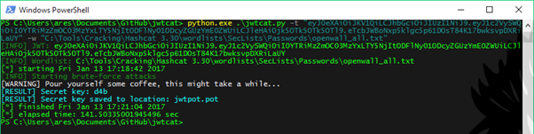

# jwtcat
[](https://www.python.org)
[](https://opensource.org/licenses/Apache-2.0)

## Cracking JSON Web Token.
This script performs offline brute-force attacks against JSON Web Token (JWT) in order to discover the secret key used for the signature. 

*Note: This script is only configured to work with signatures generated using the 'HS256' hashing algorithm.*

More information about JWT vulnerabilities can be found at:

<https://auth0.com/blog/critical-vulnerabilities-in-json-web-token-libraries/>



## Installation
```
$ git clone https://github.com/AresS31/jwtcat
$ cd jwtcat
# pip3 install -r requirements.txt
```

### Usage
```
$ python3 jwtcat.py [-h] -t TOKEN [-v] -w WORDLIST

[-t, --token]:      JSON Web Token 
[-v, --verbose]:    enable verbose
[-w, --wordlist]:   wordlist containing the passwords
[-h, --help]:       display help
```

## Dependencies
### Third-party libraries
#### PyJWT 1.4.2
The *python3-jwt* package is required. 

<https://pypi.python.org/pypi/PyJWT/1.4.2> 

#### python-colorlog
The *python-colorlog* package is required. 

<https://pypi.python.org/pypi/colorlog>

## Possible Improvements
- [ ] Increase the script performances.

## Licenses
### jwtcat
Copyright (C) 2017 Alexandre Teyar

Licensed under the Apache License, Version 2.0 (the "License");
you may not use this file except in compliance with the License.
You may obtain a copy of the License at

<http://www.apache.org/licenses/LICENSE-2.0>

Unless required by applicable law or agreed to in writing, software
distributed under the License is distributed on an "AS IS" BASIS,
WITHOUT WARRANTIES OR CONDITIONS OF ANY KIND, either express or implied.
See the License for the specific language governing permissions and
   limitations under the License. 

### PyJWT 1.4.2
Copyright (c) 2015 José Padilla

Permission is hereby granted, free of charge, to any person obtaining a copy
of this software and associated documentation files (the "Software"), to deal
in the Software without restriction, including without limitation the rights
to use, copy, modify, merge, publish, distribute, sublicense, and/or sell
copies of the Software, and to permit persons to whom the Software is
furnished to do so, subject to the following conditions:

The above copyright notice and this permission notice shall be included in all
copies or substantial portions of the Software.

THE SOFTWARE IS PROVIDED "AS IS", WITHOUT WARRANTY OF ANY KIND, EXPRESS OR
IMPLIED, INCLUDING BUT NOT LIMITED TO THE WARRANTIES OF MERCHANTABILITY,
FITNESS FOR A PARTICULAR PURPOSE AND NONINFRINGEMENT. IN NO EVENT SHALL THE
AUTHORS OR COPYRIGHT HOLDERS BE LIABLE FOR ANY CLAIM, DAMAGES OR OTHER
LIABILITY, WHETHER IN AN ACTION OF CONTRACT, TORT OR OTHERWISE, ARISING FROM,
OUT OF OR IN CONNECTION WITH THE SOFTWARE OR THE USE OR OTHER DEALINGS IN THE
SOFTWARE.

### python-colorlog
Copyright (c) 2012 Sam Clements sam@borntyping.co.uk

Permission is hereby granted, free of charge, to any person obtaining a copy
of this software and associated documentation files (the "Software"), to deal
in the Software without restriction, including without limitation the rights
to use, copy, modify, merge, publish, distribute, sublicense, and/or sell
copies of the Software, and to permit persons to whom the Software is
furnished to do so, subject to the following conditions:

The above copyright notice and this permission notice shall be included in all
copies or substantial portions of the Software.

THE SOFTWARE IS PROVIDED "AS IS", WITHOUT WARRANTY OF ANY KIND, EXPRESS OR
IMPLIED, INCLUDING BUT NOT LIMITED TO THE WARRANTIES OF MERCHANTABILITY,
FITNESS FOR A PARTICULAR PURPOSE AND NONINFRINGEMENT. IN NO EVENT SHALL THE
AUTHORS OR COPYRIGHT HOLDERS BE LIABLE FOR ANY CLAIM, DAMAGES OR OTHER
LIABILITY, WHETHER IN AN ACTION OF CONTRACT, TORT OR OTHERWISE, ARISING FROM,
OUT OF OR IN CONNECTION WITH THE SOFTWARE OR THE USE OR OTHER DEALINGS IN THE
SOFTWARE.
